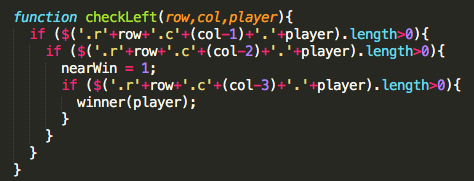

# Connect Four!

##Synopsis:

 This game pits two players against each other to try line up four of their color pieces in either a row column or diagonal. The first player to accomplish this task wins.

##Code Example:

###win logic

##Motivation

 I've always like strategy games, and this one is one of my favorites.

 ##Technology

 *HTML
 *Javascript
 *Jquery
 *Css

##Installation

1. fork the lab on github
2. clone to local
3. open index.html
4. $$$

html is in index.html
app is in app.js
css is in style.css

Or visit the url [here!](http://exporter-tiger-32220.bitballoon.com/)

##Contributors

 1. Ben
 2. Alex
 3. Ilias

 you guys helped alot, thank you.

